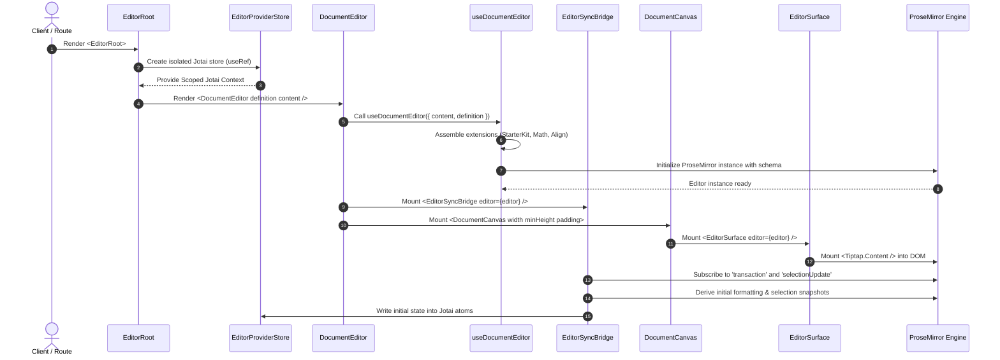
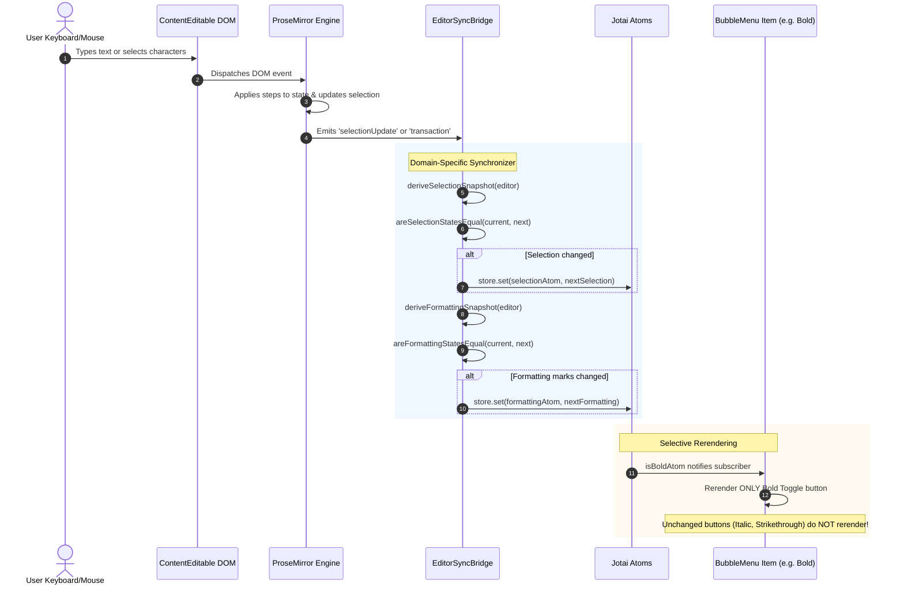
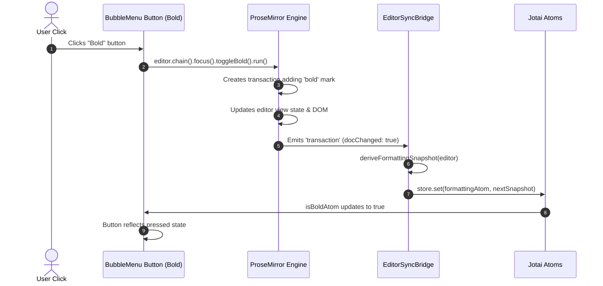

# Document System Architecture & End-to-End Flow

This document provides a comprehensive, deep-dive specification of the Document System in **Fenr**. It details the separation of concerns, the lifecycle of documents, the synchronization mechanics between ProseMirror/Tiptap and Jotai, the component hierarchy, the extensibility model, and the data flow across every layer of the editor.

---

## 1. Architectural Overview & Core Principles

The editor architecture is built around five strict design principles:

1. **Unidirectional State Synchronization with Shallow Gating**:
   ProseMirror (via Tiptap) is the single source of truth for rich-text document state, transactions, and selection ranges. React and Jotai represent the reactive UI projection. State flows unidirectionally from ProseMirror into an instance-isolated Jotai store via a dedicated `EditorSyncBridge`. Redundant atom writes are eliminated through shallow state comparison before writing to the store.

2. **Fine-Grained Reactive Atom Subscriptions**:
   Instead of forcing UI components (e.g., `BubbleMenu`, `SlashMenu`, `BlockToolbar`) to subscribe to a monolithic snapshot or rerender on every editor transaction, formatting flags and selection states are decomposed into atomic, derived selectors (`isBoldAtom`, `isItalicAtom`, `textTypeAtom`, etc.). Only components observing changed attributes rerender.

3. **Separation of Presentation, Canvas Geometry, and Orchestration**:
   - `EditorSurface` is purely presentational: it mounts the ProseMirror DOM node (`<Tiptap.Content />`) and nothing else.
   - `DocumentCanvas` is purely geometric: it establishes the physical page metaphor (width, min-height, margins, padding, elevation) independently of ProseMirror CSS.
   - `DocumentEditor` is an orchestrator: it binds the editor instance, sync bridge, canvas, and chrome into a coherent unit.

4. **Multi-Instance Store Isolation**:
   Every document editor hierarchy is encapsulated by an `EditorRoot`. The `EditorRoot` provisions an isolated Jotai store (`createStore()`), guaranteeing that multiple document instances on the same screen (e.g., side-by-side comparison, preview modal, multi-tab workspace) never leak or cross-contaminate formatting or selection state.

5. **Type-Driven Document Definitions (`DocumentDefinition`)**:
   Different document types (e.g., Proposals, Invoices, Quotes, General Documents) vary in page dimensions, extension bundles, and editing capabilities. Rather than hardcoding these permutations, documents are declared using `DocumentDefinition` contracts passed into `DocumentEditor`.

---

## 2. High-Level System Topography

```text
┌────────────────────────────────────────────────────────────────────────┐
│                              EditorRoot                                │
│  - Isolated Jotai Store (<EditorProviderStore />)                      │
│  - Centralized Vendor & Editor Styles (KaTeX CSS, Prose Tokens)       │
└───────────────────────────────────┬────────────────────────────────────┘
                                    │
                                    ▼
┌────────────────────────────────────────────────────────────────────────┐
│                            DocumentEditor                              │
│  - Orchestrator for engine, synchronization, canvas, and chrome        │
│  - Accepts `DocumentDefinition`, `content`, `onChange`                 │
│  - Instantiates editor engine via `useDocumentEditor`                  │
└───────┬──────────────────────┬─────────────────────────┬───────────────┘
        │                      │                         │
        ▼                      ▼                         ▼
┌──────────────────┐  ┌──────────────────┐  ┌────────────────────────────┐
│ EditorSyncBridge │  │   EditorChrome   │  │       DocumentCanvas       │
│ - Tiptap Event   │  │   (BubbleMenu,   │  │ - Physical Page Metaphor   │
│   Listeners      │  │   SlashMenu,     │  │ - Width, MinHeight, Padding│
│ - Shallow Gating │  │   BlockToolbar)  │  │ - Paper Shadow & Border    │
│ - Jotai Writes   │  │ - Fine-grained   │  └─────────────┬──────────────┘
└───────┬──────────┘  │   Atom Consumers │                │
        │             └──────────────────┘                ▼
        │                      ▲             ┌───────────────────────────┐
        ▼                      │             │       EditorSurface       │
┌──────────────────────────────┴──────────┐  │ - Pure Viewport Container │
│            Scoped Jotai Store           │  │ - <Tiptap.Content />      │
│  - Primitive `formattingAtom`           │  └─────────────┬─────────────┘
│  - Primitive `selectionAtom`            │                │
│  - Selectors: `isBoldAtom`, etc.        │                ▼
└─────────────────────────────────────────┘  ┌───────────────────────────┐
                                             │   Tiptap / ProseMirror    │
                                             │ - Document Model (Node)   │
                                             │ - Selection (Text/Node)   │
                                             │ - Step / Transactions     │
                                             └───────────────────────────┘
```

---

## 3. End-to-End Sequence Flows

### Flow A: Initialization and Mounting Lifecycle



#### Step-by-Step Explanation:
1. **Store Provisioning**: `EditorRoot` evaluates if an external store was provided. If not, it lazily creates a new store instance via `createStore()` stored in a React `useRef`. This provides isolated context to all child consumers.
2. **Global Style Ingestion**: KaTeX and typography styles are imported at the `EditorRoot` module boundary once, preventing duplicated stylesheet imports in subcomponents.
3. **Engine Configuration**: `useDocumentEditor` merges base extensions with capabilities declared on `DocumentDefinition` (e.g. conditionally pushing `@tiptap/extension-mathematics`).
4. **DOM Mounting**: `EditorSurface` wraps `<Tiptap.Content />`, which creates the `ProseMirror-view` element inside the canvas.
5. **Bridge Binding**: `EditorSyncBridge` runs its initial synchronization pass on mount, extracting default marks and selection ranges, and populating `formattingAtom` and `selectionAtom`.

---

### Flow B: User Typing & Selection Changes (PM → Jotai → Reactive UI)



#### Step-by-Step Explanation:
1. **Transaction Trigger**: When the user presses a key or drags to select text, ProseMirror generates a `Transaction`.
2. **Transaction Classification**:
   - If `transaction.selectionSet === true`, `deriveSelectionSnapshot` extracts the new `{ from, to, empty }` range.
   - If `transaction.docChanged === true` or `transaction.selectionSet === true`, active marks and node attributes at the cursor position are derived via `deriveFormattingSnapshot`.
3. **Equality Gating**:
   - `areSelectionStatesEqual` compares `{ from, to, empty }`.
   - `areFormattingStatesEqual` executes a 14-point boolean check across active marks (`isBold`, `isItalic`, `textType`, `isMath`, alignments, etc.).
   - If the evaluated snapshot matches the store's current value, **no atom write occurs**.
4. **Granular Notification**: If bold state changed from `false` to `true`, only `isBoldAtom` triggers a recomputation. The `ToggleGroupItem` for Bold rerenders; the canvas, the surface, and other toolbar items remain untouched.

---

### Flow C: UI Action Dispatch (UI → PM Command → Transaction)



---

## 4. Deep-Dive Component & Element Breakdown

### 4.1. `DocumentDefinition` & Configuration Boundary

File: [`apps/web/src/editor/core/types.ts`](file:///home/muchiri/dev/bag/atelier/fenr/apps/web/src/editor/core/types.ts)

The document system accommodates multiple business document models (Proposals, Invoices, Contracts, Notes). `DocumentDefinition` formalizes the schema, layout, and capability boundaries into a single declarative structure:

```ts
export type DocumentType = "proposal" | "invoice" | "quote" | "document"

export interface CanvasConfig {
  width?: number
  minHeight?: number
  padding?: {
    x: number
    y: number
  }
}

export interface EditorCapabilities {
  mathematics?: boolean
  tables?: boolean
  images?: boolean
  embeds?: boolean
}

export interface EditorConfig {
  extensions?: AnyExtension[]
  editorProps?: EditorProps
  editable?: boolean
}

export interface DocumentDefinition {
  type: DocumentType
  canvas?: CanvasConfig
  editor?: EditorConfig
  capabilities?: EditorCapabilities
}
```

#### How it works:
- **`defineDocument(config)`**: A type-safe builder function that enforces validation and provides IDE autocompletion for document definitions.
- **`defaultDocumentDefinition`**: Standard US Letter-sized document configuration (`width: 816`, `minHeight: 1056`, `padding: { x: 72, y: 72 }`).
- **Capability Flags**: Allows modular inclusion of heavy extensions. For instance, an Invoice definition can disable `mathematics` and enable `tables`, saving runtime overhead.

---

### 4.2. `EditorRoot` & Store Encapsulation

Files: 
- [`apps/web/src/editor/root/editor-root.tsx`](file:///home/muchiri/dev/bag/atelier/fenr/apps/web/src/editor/root/editor-root.tsx)
- [`apps/web/src/editor/state/editor-store.tsx`](file:///home/muchiri/dev/bag/atelier/fenr/apps/web/src/editor/state/editor-store.tsx)

```tsx
export interface EditorRootProps {
  children: ReactNode
  store?: EditorStore
}

export const EditorRoot = ({ children, store }: EditorRootProps) => {
  return <EditorProviderStore store={store}>{children}</EditorProviderStore>
}
```

#### Technical Mechanics:
1. **Isolated Jotai Provider**: `EditorProviderStore` uses `useRef<EditorStore | null>(null)` to ensure a single Jotai store is instantiated per editor lifecycle. Child components access this store via React Context without ever leaking to the global Jotai default store.
2. **Styles Boundary**: `import "../styles"` is executed exclusively at `EditorRoot`. This centralizes KaTeX (`katex.min.css`) and global editor typography styles, guaranteeing that neither `EditorSurface` nor individual buttons carry side-effecting stylesheet imports.

---

### 4.3. `DocumentEditor` Orchestrator

File: [`apps/web/src/editor/core/document-editor.tsx`](file:///home/muchiri/dev/bag/atelier/fenr/apps/web/src/editor/core/document-editor.tsx)

```tsx
export function DocumentEditor({
  content,
  definition = defaultDocumentDefinition,
  editable = true,
  onChange,
  className,
}: DocumentEditorProps) {
  const editor = useDocumentEditor({
    content,
    definition,
    editable,
    onChange,
  })

  if (!editor) return null

  return (
    <div className={cn("relative w-full", className)}>
      <EditorSyncBridge editor={editor} />
      <BubbleMenu editor={editor} />
      <DocumentCanvas
        width={definition.canvas?.width}
        minHeight={definition.canvas?.minHeight}
        padding={definition.canvas?.padding}
      >
        <EditorSurface editor={editor} />
      </DocumentCanvas>
    </div>
  )
}
```

#### Key Architecture Separation:
- **Synchronization is NOT a surface concern**: Moving `EditorSyncBridge` out of `EditorSurface` and into `DocumentEditor` establishes clean separation. The surface is solely responsible for DOM nodes; the orchestrator binds synchronization and chrome to the editor engine.
- **Pass-through Geometry**: The canvas geometry (`width`, `minHeight`, `padding`) is read directly from `definition.canvas`, allowing arbitrary layout templates without modifying CSS classes.

---

### 4.4. `EditorSyncBridge` Synchronization Engine

File: [`apps/web/src/editor/state/sync/editor-sync-bridge.tsx`](file:///home/muchiri/dev/bag/atelier/fenr/apps/web/src/editor/state/sync/editor-sync-bridge.tsx)

`EditorSyncBridge` is a renderless component (`return null`) that binds to Tiptap's lifecycle events and mediates state transfer into Jotai.

#### Snapshot Extractors:
1. **`deriveFormattingSnapshot(editor)`**:
   - Queries ProseMirror active marks (`bold`, `italic`, `strike`, `code`, `inlineMath`, `blockMath`).
   - Resolves active node types (`heading` with levels 1, 2, 3, `bulletList`, `orderedList`, `codeBlock`, `blockquote`).
   - Determines explicit or implicit text alignment (`left`, `center`, `right`, `justify`), defaulting to `left` when no explicit mark is present.
2. **`deriveSelectionSnapshot(editor)`**:
   - Extracts `{ from, to, empty }` directly from `editor.state.selection`.

#### Domain-Specific Synchronization Logic:
```ts
const handleSelectionUpdate = () => {
  syncSelection()
  syncFormatting()
}

const handleTransaction = ({ transaction }) => {
  if (transaction.selectionSet) {
    syncSelection()
  }
  if (transaction.docChanged || transaction.selectionSet) {
    syncFormatting()
  }
}

editor.on("selectionUpdate", handleSelectionUpdate)
editor.on("transaction", handleTransaction)
```
- **Why this matters**: In large documents, transactions that do not mutate the selection or structure do not run unnecessary selection derivations.
- **Shallow Comparison Guard**:
  ```ts
  if (!areFormattingStatesEqual(currentSnapshot, nextSnapshot)) {
    store.set(formattingAtom, nextSnapshot)
  }
  ```
  If typing within an existing paragraph does not change the active marks or heading level, `formattingAtom` is **never written to**.

---

### 4.5. Jotai State Hierarchy & Selector Network

Files:
- [`apps/web/src/editor/state/atoms/formatting.ts`](file:///home/muchiri/dev/bag/atelier/fenr/apps/web/src/editor/state/atoms/formatting.ts)
- [`apps/web/src/editor/state/atoms/selection.ts`](file:///home/muchiri/dev/bag/atelier/fenr/apps/web/src/editor/state/atoms/selection.ts)

```text
               ┌───────────────────────┐
               │    formattingAtom     │ (Primitive Atom: FormattingState)
               └───────────┬───────────┘
     ┌──────────────┬──────┴───────┬──────────────┬──────────────┐
     ▼              ▼              ▼              ▼              ▼
┌──────────┐  ┌──────────┐  ┌──────────────┐ ┌──────────┐ ┌──────────────┐
│isBoldAtom│  │isItalic..│  │textTypeAtom  │ │isMathAtom│ │isAlignLeft...│
└──────────┘  └──────────┘  └──────────────┘ └──────────┘ └──────────────┘
     │              │              │              │              │
     ▼              ▼              ▼              ▼              ▼
[Bold Button] [Italic Btn]  [Type Dropdown]  [Math Btn]   [Align Buttons]
```

#### Anatomy of Granular Selectors:
```ts
export const formattingAtom = atom<FormattingState>(DEFAULT_FORMATTING_STATE)

export const isBoldAtom = atom((get) => get(formattingAtom).isBold)
export const isItalicAtom = atom((get) => get(formattingAtom).isItalic)
export const textTypeAtom = atom((get) => get(formattingAtom).textType)
```

- Each selector subscribes to the root `formattingAtom`.
- Jotai tracks dependency equality: when `formattingAtom` changes, derived atoms only notify their subscribers if the computed return value (`boolean` or `string`) has changed (`Object.is` check).
- Result: Toggling bold from the keyboard triggers **only** the Bold button rerender.

---

### 4.6. `DocumentCanvas` & Geometry Metaphor

File: [`apps/web/src/editor/core/document-canvas.tsx`](file:///home/muchiri/dev/bag/atelier/fenr/apps/web/src/editor/core/document-canvas.tsx)

```tsx
export function DocumentCanvas({
  width = 816,
  minHeight = 1056,
  padding = { x: 72, y: 72 },
  children,
  className,
  style,
  ...props
}: DocumentCanvasProps) {
  return (
    <article
      {...props}
      data-document-canvas
      className={cn("relative mx-auto bg-background shadow-xs", className)}
      style={{
        ...style,
        width: typeof width === "number" ? `${width}px` : width,
        minHeight: typeof minHeight === "number" ? `${minHeight}px` : minHeight,
        padding: `${padding.y}px ${padding.x}px`,
      }}
    >
      {children}
    </article>
  )
}
```

- **Physical Page Boundary**: Implements the standard `816px x 1056px` dimensions representing an 8.5" x 11" page at 96 DPI, with 0.75" margins (`72px`).
- **Semantic Article Tag**: Rendered as `<article data-document-canvas>`, enabling styling hooks and print styles (`@media print`) to target the canvas cleanly.
- **Defensive Sizing**: Handles both raw numbers (converted to pixels) and custom CSS unit strings (e.g., `100%`, `210mm`).

---

### 4.7. `EditorSurface` Presentation Layer

File: [`apps/web/src/editor/core/editor-surface.tsx`](file:///home/muchiri/dev/bag/atelier/fenr/apps/web/src/editor/core/editor-surface.tsx)

```tsx
export interface EditorSurfaceProps extends HTMLAttributes<HTMLDivElement> {
  editor: Editor
}

export const EditorSurface = ({
  editor,
  className,
  ...props
}: EditorSurfaceProps) => {
  return (
    <div className={className} {...props}>
      <Tiptap editor={editor}>
        <Tiptap.Content />
      </Tiptap>
    </div>
  )
}
```

- **Zero Business Logic**: Contains no event listeners, no synchronization hooks, and no styling tokens other than forwarding `className`.
- **ProseMirror Hook**: `<Tiptap.Content />` binds the ProseMirror view DOM tree to React's virtual DOM reconciliation boundary.

---

### 4.8. `BubbleMenu` & UI Chrome

File: [`apps/web/src/editor/bubble-menu.tsx`](file:///home/muchiri/dev/bag/atelier/fenr/apps/web/src/editor/bubble-menu.tsx)

`BubbleMenu` mounts a floating toolbar positioned relative to the current text selection:

- **Decoupled Editor Source**: Accepts `editor?: Editor | null` from props, falling back to Tiptap's `useCurrentEditor()` context.
- **Fine-Grained Consumers**:
  ```tsx
  const isBold = useAtomValue(isBoldAtom)
  const isItalic = useAtomValue(isItalicAtom)
  const textType = useAtomValue(textTypeAtom)
  // ...
  ```
- **Design Tokens & Icons**: Strictly uses `@workspace/ui` primitives (`Button`, `DropdownMenu`, `ToggleGroup`, `Tooltip`) with `@hugeicons/react` icons, conforming to the monorepo design system.

---

## 5. Extensibility: Defining New Document Types

Adding a new document type requires **zero modifications** to the core editor engine or bridge. Simply declare a definition and pass it to `DocumentEditor`:

```ts
import { defineDocument } from "@/editor/core/types"
import Table from "@tiptap/extension-table"
import TableRow from "@tiptap/extension-table-row"
import TableCell from "@tiptap/extension-table-cell"

// 1. Invoice Document Definition
export const invoiceDefinition = defineDocument({
  type: "invoice",
  canvas: {
    width: 816,
    minHeight: 1056,
    padding: { x: 48, y: 48 }, // Compact margins
  },
  capabilities: {
    mathematics: false, // Invoices do not require LaTeX formulas
    tables: true,
  },
  editor: {
    extensions: [
      Table.configure({ resizable: true }),
      TableRow,
      TableCell,
    ],
  },
})

// 2. Proposal Document Definition
export const proposalDefinition = defineDocument({
  type: "proposal",
  canvas: {
    width: 900, // Wider presentation format
    minHeight: 1200,
    padding: { x: 72, y: 72 },
  },
  capabilities: {
    mathematics: true,
    images: true,
    embeds: true,
  },
})
```

---

## 6. Defensive Programming & Invariants

| Layer | Potential Failure Mode | Defensive Guard Implemented |
| :--- | :--- | :--- |
| **`useDocumentEditor`** | Accessing editor methods before instance initialization | All editor calls guard with `if (!editor) return null`. |
| **`EditorSyncBridge`** | Subscription events firing on destroyed editor instances | `deriveFormattingSnapshot` checks `if (!editor \|\| editor.isDestroyed) return DEFAULT_FORMATTING_STATE`. |
| **`EditorSyncBridge`** | Memory leaks when switching documents | `useEffect` cleanup hook calls `editor.off("transaction")` and `editor.off("selectionUpdate")`. |
| **`EditorStore`** | Cross-document state leakage in multi-editor views | `useRef` guarantees unique `createStore()` instances per `EditorRoot`. |
| **`DocumentCanvas`** | Invalid / missing numeric styles | Safe fallbacks (`816px`, `1056px`) and explicit unit conversion (`${val}px`). |
| **`BubbleMenu`** | Floating menu positioned before editor mounts | Safe early return `if (!editor) return null` positioned after all hook declarations. |

---

## 7. Verification & Automated Test Suite

The document architecture is verified by comprehensive automated tests run via `bun test`:

1. **Store Isolation Test** ([`apps/web/src/editor/state/editor-store.test.ts`](file:///home/muchiri/dev/bag/atelier/fenr/apps/web/src/editor/state/editor-store.test.ts)):
   - Verifies that store A and store B remain completely isolated under concurrent mutations.
   - Asserts default formatting and selection states.
2. **Sync Bridge Pure Functions Test** ([`apps/web/src/editor/state/sync-bridge.test.ts`](file:///home/muchiri/dev/bag/atelier/fenr/apps/web/src/editor/state/sync-bridge.test.ts)):
   - Tests `deriveFormattingSnapshot` across headings, marks, alignments, lists, math, and destroyed instances.
   - Tests `deriveSelectionSnapshot` extraction.
   - Tests `areStatesEqual` and `areSelectionStatesEqual` predicates.
3. **Document Definition Contract Test** ([`apps/web/src/editor/core/document-definition.test.ts`](file:///home/muchiri/dev/bag/atelier/fenr/apps/web/src/editor/core/document-definition.test.ts)):
   - Tests defaults and custom overrides for `DocumentDefinition`.

All tests can be executed at the root of the monorepo:
```sh
bun test
bun run check
```
