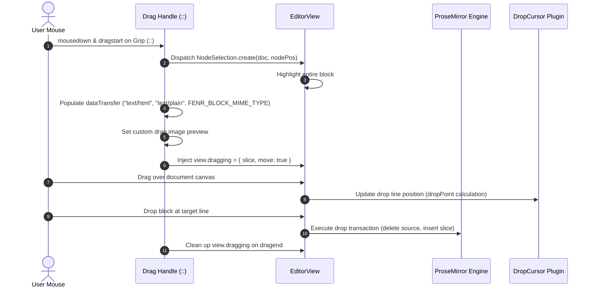

# Block Drag Handle Subsystem Architecture

> **Topic**: Block Drag Handle & Native Drag-and-Drop Subsystem  
> **Subsystem**: `apps/web/src/editor/drag-handle/`  
> **Integration Boundary**: `DocumentEditor`, `DocumentCanvas`, Scoped Jotai Store, ProseMirror Engine  
> **Repository Context**: ProseMirror / Tiptap v3 + Jotai + React 19 + Tailwind CSS v4 + Bun  

---

## 1. Executive Summary & Design Paradigm

In modern rich-text and document engineering (e.g. Notion, Linear, Slite, BlockNote), documents are modeled not as unstructured streams of inline text, but as **trees of discrete, manipulable blocks** (paragraphs, headings, lists, blockquotes, code blocks).

The **Drag Handle** serves as the primary physical affordance for block-level manipulation:
1. **Visual Indicator**: Appears seamlessly in the canvas gutter beside whichever block the user hovers over.
2. **Quick Insert (`+`)**: Appends an empty paragraph directly beneath the target block.
3. **Structural Drag & Drop (`⋮⋮`)**: Enables reordering blocks within the document tree using native browser HTML5 drag-and-drop coordinated with ProseMirror transactions.
4. **Context Actions Menu**: Right-click or double-click on the grip opens block transformation options (Turn into Text, Headings 1–3, Lists, Quote, Code Block) and clipboard utilities.
5. **Dedicated Delete Affordance**: A dedicated round delete button appears in the right canvas gutter aligned with the hovered block.

### Architectural Evaluation: Paradigm Comparison

Rich-text architectures approach block handles through three primary models:

```text
┌──────────────────────────────────────────────────────────────────────────────────────────────────┐
│ PARADIGM A: Per-Node DOM Wrapping (Inline NodeViews)                                             │
│ Each block renders a custom NodeView containing handle chrome in its local DOM.                 │
│                                                                                                  │
│ [Grip] Paragraph 1 text...                                                                       │
│ [Grip] Heading 1 text...                                                                         │
│                                                                                                  │
│ ❌ Heavy DOM footprint: N blocks = N React NodeViews + N handle DOM nodes mounted.               │
│ ❌ Fragile text selection: Selecting across multiple blocks highlights the handle DOM nodes.     │
│ ❌ High memory overhead; layout recalculations on every keystroke.                               │
└──────────────────────────────────────────────────────────────────────────────────────────────────┘

┌──────────────────────────────────────────────────────────────────────────────────────────────────┐
│ PARADIGM B: Static Left-Gutter Column (Fixed Rail)                                               │
│ The document canvas is split into a multi-column CSS grid (gutter rail on left, editor on right).│
│                                                                                                  │
│ ❌ Requires aligning rail items to fluctuating block heights dynamically (JS sync loops).        │
│ ❌ Breeds scroll desynchronization bugs and complex virtualization issues.                       │
└──────────────────────────────────────────────────────────────────────────────────────────────────┘

┌──────────────────────────────────────────────────────────────────────────────────────────────────┐
│ PARADIGM C: Headless Virtual Anchor with a Single Floating Handle (Fenr Implementation)          │
│ Exactly ONE floating handle element exists. As the pointer moves across the canvas or gutter,   │
│ ProseMirror resolves the hovered block and repositions the single handle beside that block.      │
│                                                                                                  │
│ ✅ Constant O(1) DOM overhead: Exactly one handle element regardless of document size (10k nodes).│
│ ✅ Zero interference with ProseMirror text selection or native clipboard events.                 │
│ ✅ Smooth transitions using CSS transforms.                                                      │
└──────────────────────────────────────────────────────────────────────────────────────────────────┘
```

**Decision**: Fenr implements **Paradigm C (Headless Virtual Anchor with a Single Floating Handle)**. This preserves an $O(1)$ DOM footprint and aligns with Fenr's headless chrome architecture established by `BubbleMenu`.

---

## 2. High-Level Subsystem Topography

```text
┌────────────────────────────────────────────────────────────────────────────────────────┐
│                                     DocumentEditor                                     │
│  - Mounts <DocumentCanvas ref={canvasRef}>                                             │
│  - Invokes `useDragHandleSync(editor, canvasRef)`                                      │
│  - Conditionally renders <DragHandle editor={editor} /> based on capabilities          │
└───────────────────────────────────────────┬────────────────────────────────────────────┘
                                            │
                                            ▼
┌────────────────────────────────────────────────────────────────────────────────────────┐
│                     Layer 1: Coordinate & Target Resolution Engine                     │
│                        (`target-resolver.ts` -> `resolveDragTarget`)                    │
│  - Clamps X coordinate to content boundary (eliminates gutter dead-zone)               │
│  - Queries `view.posAtCoords` with vertical clamping                                   │
│  - Resolves `$pos` and walks tree depth (extracts `listItem` over whole list)          │
│  - Resolves target block DOM node (`view.nodeDOM` / `view.domAtPos` fallback)          │
└───────────────────────────────────────────┬────────────────────────────────────────────┘
                                            │
                                            ▼
┌────────────────────────────────────────────────────────────────────────────────────────┐
│                        Layer 2: Scoped Jotai State Bridge                              │
│                    (`drag-handle.ts` & `drag-handle-plugin.ts`)                        │
│  - `dragHandleAtom`: { visible, top, nodePos, nodeType, isLocked }                     │
│  - Fine-grained derived selectors (`isDragHandleVisibleAtom`, `dragHandleTopAtom`, etc.) │
│  - RAF-throttled pointermove listener on canvas                                        │
│  - Shallow equality gating (`areDragHandleStatesEqual`) to prevent redundant renders   │
│  - Row stability retention: retains active block while cursor moves within row height  │
└───────────────────────────────────────────┬────────────────────────────────────────────┘
                                            │
                      ┌─────────────────────┴─────────────────────┐
                      ▼                                           ▼
┌───────────────────────────────────────────┐ ┌───────────────────────────────────────────┐
│     Layer 3: HTML5 Drag & Drop Engine     │ │      Layer 4: Presentational Chrome       │
│        (`drag-drop-handlers.ts`)          │ │            (`drag-handle.tsx`)            │
│ - Dispatches `NodeSelection` for block    │ │ - Left Gutter: Quick Add (+) & Grip (::)  │
│ - Serializes slice (`text/html`, text)    │ │ - Grip context menu: Turn Into, Copy Text │
│ - Populates `view.dragging = { slice }`   │ │ - Right Gutter: Dedicated Delete Button   │
│ - Sets custom drag ghost preview image    │ │ - Strictly uses @workspace/ui & Hugeicons │
└───────────────────────────────────────────┘ └───────────────────────────────────────────┘
```

---

## 3. Deep Technical Mechanics

### 3.1. Eliminating the "Gutter Dead-Zone" via Coordinate Clamping

A classic challenge in floating drag handles is pointer resolution when hovering in the margin/gutter:
- `view.posAtCoords({ left, top })` queries the browser DOM. When the cursor is in the canvas gutter (outside the text content bounding box), `posAtCoords` returns `null` or erratically jumps to the document header/footer.

Fenr solves this with **horizontal coordinate clamping**:

```ts
export function resolveDragTarget(
  view: EditorView | null | undefined,
  clientX: number,
  clientY: number,
  options: ResolveDragTargetOptions = {},
): DragTarget | null {
  if (!view || view.isDestroyed || !view.dom || view.editable === false) {
    return null
  }

  const editorRect = view.dom.getBoundingClientRect()
  const gutterMargin = options.gutterMargin ?? 80
  const clampedInset = options.clampedInset ?? 12

  // Return early if pointer is far outside vertical or horizontal boundaries
  if (
    clientY < editorRect.top - 10 ||
    clientY > editorRect.bottom + 10 ||
    clientX < editorRect.left - gutterMargin ||
    clientX > editorRect.right + gutterMargin
  ) {
    return null
  }

  // Every block in left-to-right text begins at the left edge of the editor content area.
  // Sampling posAtCoords at editorRect.left + clampedInset guarantees that we reliably hit
  // the block on this vertical line, regardless of whether clientX is in the left gutter,
  // the text body, or approaching the delete button in the right gutter.
  const clampedX = editorRect.left + clampedInset
  const coords = view.posAtCoords({ left: clampedX, top: clientY })
  // ...
}
```

### 3.2. Structural Depth Resolution

When `posAtCoords` returns a document offset, it points to an inline character offset (depth 2 or 3 in the document tree):

```text
doc (depth 0)
 └── bulletList (depth 1)
      └── listItem (depth 2)   <-- TARGET NODE FOR LISTS
           └── paragraph (depth 3)
                └── "Item text" (inline text offset)
```

Naive resolution at `depth === 1` would drag the entire `bulletList`. Conversely, resolution at `depth === 3` would drag only the paragraph inside the bullet.

The target resolver walks the resolved position tree from leaf to root:
1. If an ancestor is `listItem` or `taskItem`, target that node at its depth.
2. Otherwise, fall back to top-level block node (`depth === 1`).
3. Ensure the selected node is a structural block (`isBlock === true`).
4. Resolve the corresponding DOM element via `view.nodeDOM(targetPos)` with fallback to `view.domAtPos(targetPos + 1)`.

### 3.3. HTML5 Drag & Drop Handshake (`view.dragging`)

ProseMirror's internal drop handler coordinates native browser drag-and-drop events:



Key Implementation in `apps/web/src/editor/drag-handle/drag-drop-handlers.ts`:
1. **`NodeSelection` Dispatch**: Selects the full block node so ProseMirror treats it as an atomic slice.
2. **Clipboard Data Transfer**: Populates `text/html` and `text/plain` using `view.serializeForClipboard(slice)`.
3. **Internal `view.dragging` Contract**: Assigns `{ slice, move: true }` to `view.dragging`. This informs ProseMirror that the upcoming drop is a block move operation rather than an external paste, triggering atomic deletion of the original block and insertion at `dropPoint(doc, targetPos, slice)`.

### 3.4. Scoped Jotai State & Row Stability Retention

The drag handle state is managed through scoped atoms in [`apps/web/src/editor/state/atoms/drag-handle.ts`](file:///home/muchiri/dev/bag/atelier/fenr/apps/web/src/editor/state/atoms/drag-handle.ts):

```ts
export interface DragHandleState {
  visible: boolean
  top: number
  nodePos: number
  nodeType: string
  isLocked: boolean
}
```

#### Row Stability (Horizontal Mouse Travel)
When moving the mouse from the left drag handle across the canvas to click the delete button on the right, the pointer leaves the text content area. Without stability safeguards, the handle would flicker or disappear.

`setupDragHandleSync` implements **active block row retention**:
- If a block is currently active, it checks whether the pointer's `clientY` remains within the vertical bounds of that block ($\pm 10\text{px}$ tolerance).
- If true, target re-resolution is skipped, keeping the handle and delete button perfectly stable while the user traverses the row.

#### Shallow Equality Gating
Hovering across lines within the same paragraph emits hundreds of `pointermove` events. Atom updates are strictly gated:
```ts
if (!areDragHandleStatesEqual(currentState, nextState)) {
  store.set(dragHandleAtom, nextState)
}
```
If `visible`, `top`, `nodePos`, `nodeType`, and `isLocked` have not changed, no Jotai write occurs and React components do not rerender.

---

## 4. Presentational Chrome & UI Design

The drag handle UI conforms strictly to Fenr's monorepo conventions:
- **Canvas Gutter Advantage**: `DocumentCanvas` defines a `72px` horizontal padding. The drag handle sits at `left: 16px` (`left-4`) and the delete button sits at `right: 16px` (`right-4`), rendering entirely within the canvas margins without overflowing into the outer layout shell.
- **Design Tokens**: `bg-background`, `text-muted-foreground`, `hover:text-foreground`, `hover:bg-destructive/10`, `text-destructive`. Zero hardcoded hex colors.
- **Hugeicons**: Exclusively `@hugeicons/react` and `@hugeicons/core-free-icons` (`Add01Icon`, `DragDropVerticalIcon`, `Delete02Icon`, etc.).
- **Block Actions Context Menu**:
  - Double-click or right-click on the grip opens a Radix/shadcn `DropdownMenu`.
  - Sets `isLocked: true` in Jotai, freezing hover tracking so the handle remains anchored while interacting with the menu.
  - Submenu provides conversion into Text, Heading 1–3, Bullet List, Numbered List, Quote, and Code Block via Tiptap transaction chains.
  - User feedback delivered via `<Sonner />` (`toast.success` / `toast.error`).

---

## 5. Defensive Programming & Invariants Matrix

| Subsystem Component | Potential Failure Mode | Defensive Guard Implemented |
| :--- | :--- | :--- |
| **`target-resolver`** | Editor unmounted or destroyed while pointer moves | Guards `if (!view \|\| view.isDestroyed \|\| !view.dom) return null`. |
| **`target-resolver`** | Editor in read-only mode (`editable: false`) | Returns `null` immediately when `view.editable === false`. |
| **`target-resolver`** | Pointer far out of canvas bounds | Bounds check against `editorRect` with `gutterMargin` threshold. |
| **`target-resolver`** | `nodeDOM` returns text node instead of element | Falls back to `view.domAtPos` and queries closest block parent. |
| **`drag-handle-plugin`** | Mobile / touch device tap triggers hover jitter | Early exit if `e.pointerType === "touch"`. |
| **`drag-handle-plugin`** | Pointer moves over handle or delete button | Checks `closest("[data-drag-handle]")` / `closest("[data-drag-delete]")` to prevent self-unmounting. |
| **`drag-handle-plugin`** | Document edited while handle is visible | Subscribes to `editor.on("transaction")` to reposition handle or hide if node was deleted. |
| **`drag-drop-handlers`** | Out-of-bounds `nodePos` on dragstart | Validates `0 <= nodePos < state.doc.content.size` before dispatching. |
| **`drag-drop-handlers`** | Drag interrupted or canceled without drop | `handleBlockDragEnd` unconditionally resets `view.dragging = null`. |
| **`drag-handle.tsx`** | Block deletion or insertion throws transaction error | Wrapped in `try / catch` with user-facing notification via `<Sonner />`. |

---

## 6. Verification & Automated Test Suite

The drag handle implementation is verified by 4 dedicated test suites running under `bun test`:

1. **`target-resolver.test.ts`** ([`apps/web/src/editor/drag-handle/target-resolver.test.ts`](file:///home/muchiri/dev/bag/atelier/fenr/apps/web/src/editor/drag-handle/target-resolver.test.ts)):
   - Verifies coordinate clamping in left and right gutters.
   - Verifies depth resolution for top-level paragraphs vs nested list items.
   - Tests read-only and destroyed editor guards.
   - Tests DOM fallback resolution via `domAtPos`.

2. **`drag-handle-state.test.ts`** ([`apps/web/src/editor/drag-handle/drag-handle-state.test.ts`](file:///home/muchiri/dev/bag/atelier/fenr/apps/web/src/editor/drag-handle/drag-handle-state.test.ts)):
   - Verifies default atom state initialization.
   - Tests derived selector logic (`isDragHandleVisibleAtom` under `visible` vs `isLocked`).
   - Asserts strict equality gating in `areDragHandleStatesEqual`.
   - Tests `setupDragHandleSync` cleanup function.

3. **`drag-drop-handlers.test.ts`** ([`apps/web/src/editor/drag-handle/drag-drop-handlers.test.ts`](file:///home/muchiri/dev/bag/atelier/fenr/apps/web/src/editor/drag-handle/drag-drop-handlers.test.ts)):
   - Verifies `NodeSelection` dispatching on drag start.
   - Verifies `dataTransfer` payload (`text/html`, `text/plain`, custom MIME type).
   - Validates `view.dragging` slice population and cleanup on drag end.

4. **`drag-handle.test.ts`** ([`apps/web/src/editor/drag-handle/drag-handle.test.ts`](file:///home/muchiri/dev/bag/atelier/fenr/apps/web/src/editor/drag-handle/drag-handle.test.ts)):
   - Verifies export contracts for `DragHandle` and `BlockDeleteButton`.
   - Asserts safe deletion range computation based on block `nodeSize`.
   - Verifies defensive behavior when passed a null editor.
